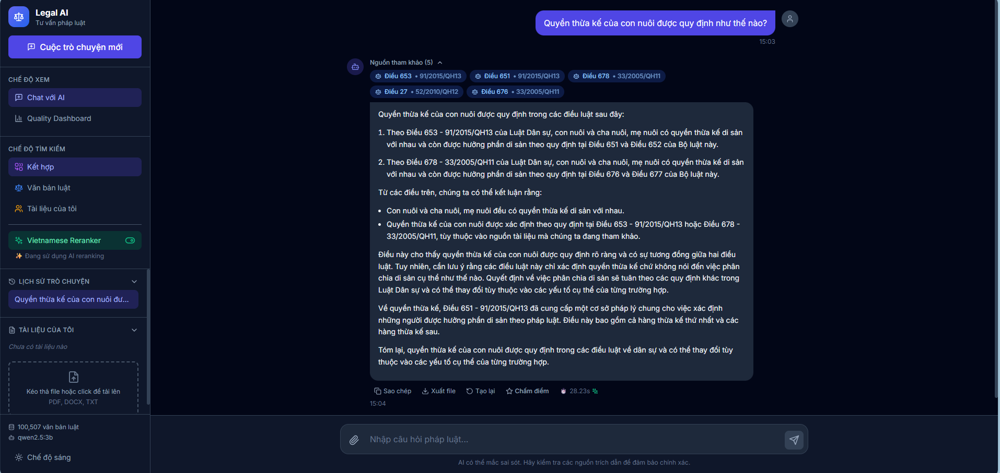
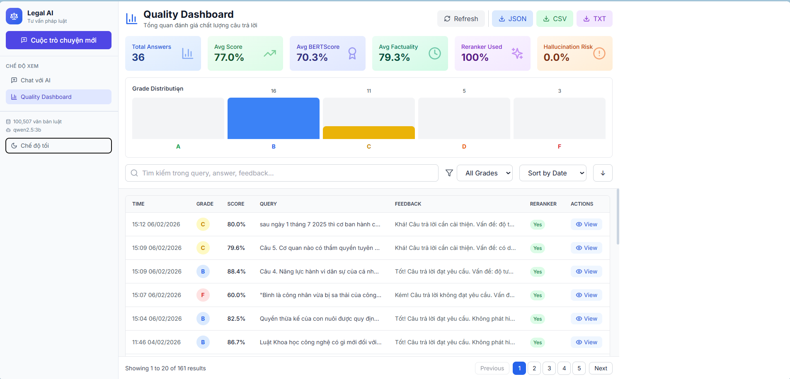

# 📜 VieLegalRAG - Vietnam Legal Law Retrieval Augmented Generation


**VieLegalRAG** là hệ thống trợ lý ảo chuyên sâu về pháp luật Việt Nam, sử dụng kiến trúc **RAG**. Hệ thống kết hợp khả năng truy xuất lai (Hybrid Search) và Reranking để cung cấp câu trả lời chính xác, minh bạch với trích dẫn điều luật cụ thể.

---

## 🎬 Demo Hệ Thống


Giao diện Chatbot thông minh hỗ trợ trả lời và trích dẫn văn bản pháp luật thời gian thực.

*(Hình ảnh minh họa hệ thống)*





---

## Kiến Trúc Hệ Thống (Advanced RAG Pipeline)

Hệ thống hoạt động theo cơ chế **Sàng lọc đa tầng (The Funnel)** để tối ưu hóa độ chính xác và giảm thiểu hiện tượng ảo giác (Hallucination) của LLM.


---

## 📂 Tài Nguyên Dự Án

| Loại tài liệu | Liên kết truy cập |
| :--- | :--- |
| **📽️ Slide Thuyết Trình** | [Xem Slide báo cáo chi tiết tại đây](docs\slide.pdf) |
| **📑 Báo Cáo Nghiên Cứu** | [Tải xuống bản PDF](docs\baocao.pdf) |
| **📁 Google Drive Tổng Hợp** | [Truy cập thư mục Drive](https://drive.google.com/drive/folders/1RYxwtqdDRKu3BJvkUezAkDm-aB6ghYky?usp=sharing) |

---

## 📊 Kết Quả Thực Nghiệm (Benchmark)

Hệ thống được đánh giá trên tập dữ liệu **ALQAC** (530 câu hỏi pháp lý thực tế).

### 1. Hiệu năng Truy xuất (Retrieval Performance)

| Chiến lược | MRR | Recall@1 | Recall@5 | Recall@10 |
| :--- | :---: | :---: | :---: | :---: |
| Sparse (BM25) | 0.752 | 0.680 | 0.810 | 0.860 |
| Dense (Vector Search) | 0.801 | 0.750 | 0.860 | 0.900 |
| Standard Hybrid | 0.873 | 0.830 | 0.920 | 0.930 |
| **VieLegalRAG (Proposed)** | **0.9499** | **0.9377** | **0.9641** | **0.9736** |

### 2. Chất lượng Sinh câu trả lời

- **BERTScore F1:** 0.8468 (Độ tương đồng ngữ nghĩa cao)
- **Extractive Rate:** 98.49% (Trích xuất trực tiếp từ luật)
- **ROUGE-L:** 0.6359 (Văn phong pháp lý chuẩn)

---

## 🛠️ Công Nghệ Sử Dụng (Tech Stack)

- **Embedding Model:** `Vietnam_legal_embeddings` (Fine-tuned).
- **Vector Database:** Qdrant (Dual-store: Local & Cloud).
- **LLM Engine:** Ollama / Qwen 2.5-3B.
- **Backend Framework:** FastAPI (Python).
- **Frontend Framework:** React + Vite + Tailwind CSS.

---


## 🚀 Hướng Dẫn Cài Đặt (Installation Guide)

### 1. Thiết lập Backend
```bash
# Clone dự án
git clone https://github.com/your-repo/VieLegalRAG.git
cd VieLegalRAG/backend

# Tạo môi trường ảo & cài đặt
python -m venv .venv
# Linux/Node: source .venv/bin/activate
# Windows: .venv\Scripts\activate
pip install -r requirements.txt
```

### 2. Chạy dịch vụ & Ứng dụng
- **Qdrant:** `docker run -p 6333:6333 qdrant/qdrant`
- **Ollama:** `ollama run qwen2.5:3b`
- **Backend:** `uvicorn main:app --reload --port 8080`
- **Frontend:** `cd ../frontend && npm install && npm run dev`

---

## 🤝 Đóng Góp (Contributing)

Mọi đóng góp đều được hoan nghênh! Vui lòng tạo Pull Request hoặc mở Issue để thảo luận về các thay đổi.


